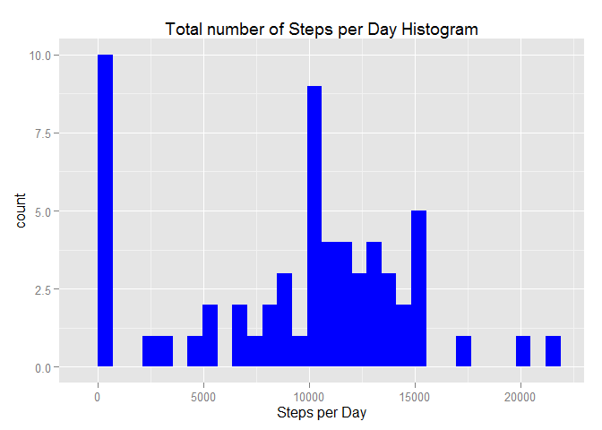
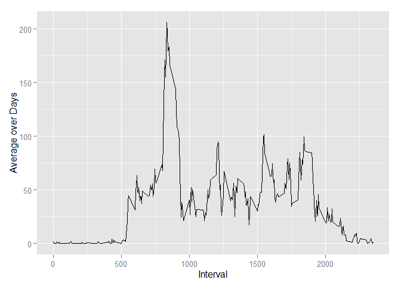
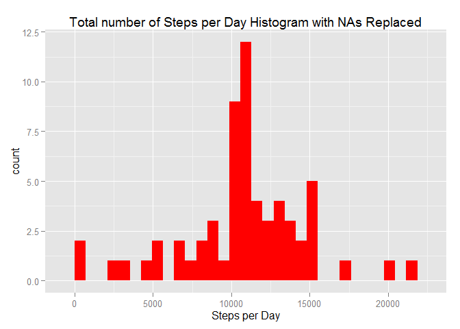
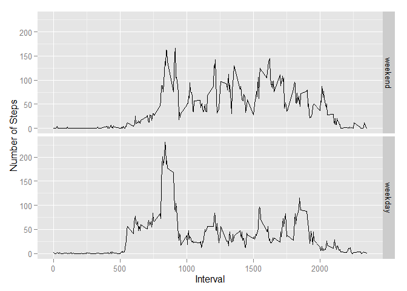

# Reproducible Research: Peer Assessment 1
Alex Crofut  

## load necessary packages, installing if necessary

```r
if (!"ggplot2" %in% installed.packages()) install.packages("ggplot2")
library("ggplot2")

if (!"plyr" %in% installed.packages()) install.packages("plyr")
library("plyr")

if (!"timeDate" %in% installed.packages()) install.packages("timeDate")
library("timeDate")
```


## Loading and preprocessing the data

```r
rawData <- read.csv(unz("activity.zip", "activity.csv"), header=TRUE, sep=",")
```


## What is mean total number of steps taken per day?
Total number of steps taken per day

```r
dailyTotals <- ddply(rawData, c("date"), summarise, sum = sum(steps, na.rm=TRUE))
```

Make a histogram of the total number of steps taken each day

```r
qplot(dailyTotals$sum,
      geom="histogram",
      main="Total number of Steps per Day Histogram",
      xlab = "Steps per Day",
      fill=I("blue"))
```



Mean of total number of steps taken per day

```r
mean(dailyTotals$sum, na.rm=TRUE)
```

```
## [1] 9354.23
```

Median of total number of steps taken per day

```r
median(dailyTotals$sum, na.rm=TRUE)
```

```
## [1] 10395
```


## What is the average daily activity pattern?
Average steps taken during 5-minute interval over all days

```r
intervalAvg <- ddply(rawData, c("interval"), summarise, mean=mean(steps, na.rm=TRUE))
```

Time series plot of 5-minute interval and average steps taken

```r
ggplot(intervalAvg, aes(x=interval, y=mean)) + 
      geom_line() +
      xlab("Interval") +
      ylab("Average over Days")
```



The 5-minute interval with the highest average steps taken

```r
intervalAvg[which.max(intervalAvg$mean),]
```

```
##     interval     mean
## 104      835 206.1698
```

## Imputing missing values
Calculate the total number of missing values in the dataset

```r
sum(is.na(rawData$steps))
```

```
## [1] 2304
```

Replace missing values with the mean for that 5-minute interval

```r
dat <- rawData
dat[c("steps")][is.na(dat[c("steps")])] <- intervalAvg$mean[match(dat$interval,intervalAvg$interval)][is.na(dat[c("steps")])]
```

Total number of steps taken per day using replaced NAs

```r
newDailyTotals <- ddply(dat, c("date"), summarise, sum = sum(steps, na.rm=TRUE))
```

Make a histogram of the total number of steps taken each day using replaced NAs

```r
qplot(newDailyTotals$sum,
      geom="histogram",
      main="Total number of Steps per Day Histogram with NAs Replaced",
      xlab = "Steps per Day",
      fill=I("red"))
```



Mean of total number of steps taken per day with NAs replaced

```r
mean(newDailyTotals$sum, na.rm=TRUE)
```

```
## [1] 10766.19
```

Median of total number of steps taken per day with NAs replaced

```r
median(newDailyTotals$sum, na.rm=TRUE)
```

```
## [1] 10766.19
```

Create a new factor variable with two levels - "weekday" and "weekend"

```r
dat$date.type <- factor((isWeekday(dat$date)), levels=c(FALSE, TRUE), labels=c("weekend", "weekday"))
```

## Are there differences in activity patterns between weekdays and weekends?
Average steps taken during 5-minute interval over all days

```r
newIntervalAvg <- ddply(dat, c("interval", "date.type"), summarise, mean=mean(steps, na.rm=TRUE))
```

Plot avg steps taken during each interval (weekdays vs weekends) on a panel plot

```r
p <- ggplot(newIntervalAvg, aes(x=interval, y=mean)) + 
      geom_line() +
      xlab("Interval") +
      ylab("Number of Steps")
p + facet_grid(date.type ~ .)
```


